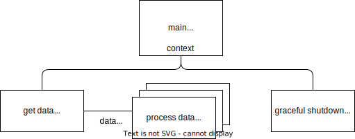

# graceful shutdown sample with go

## architecture

- There are two types of business logic: `get data goroutine`, which continues to acquire data, and `process data groutine`, which operates with multiple goroutines and continues to process data.
  - When a signal is received, stop the goroutine safely by the following procedure:
    1. stop getting data from `get data goroutine`.
    2. Close the `data channel` when it becomes empty.
- The signal is controlled by `graceful shutdown goroutine`.
  - The context generated by `main goroutine` is shared with `get data goroutine`.
  - It receives `SIGINT` and `SIGTERM` and generates cancel.
  - If the deadline is exceeded, stop processing even if it is still in progress.
